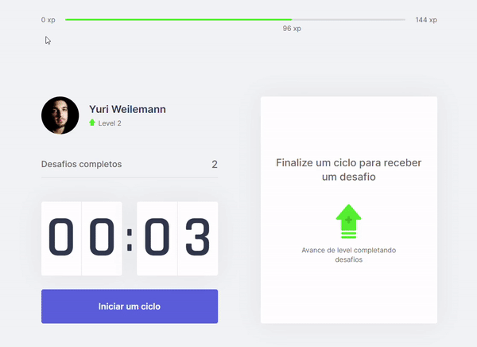

# 🏋️‍♀️ Move.it

## 📃Description
Move.It is a simple application developed during 4th Rocketseat's Next Level Week focused in React.JS, Next.JS and Typescript. The purpose of this application is to make it possible for people who spend a lot of time in front of a computer or sitting in a chair to take care of their health through periodic and quick exercises. 

<p align="center">
  
</p>

## 🕹How to Start

### Clone the repository
```bash
git clone https://github.com/weilemann/Move.it.git
```

### Install dependencies
```bash
yarn
```
or
```bash
npm install
```

### Run the code
```bash
yarn dev
```
or
```bash
npm run dev
```

### And done! 🎉
Now you are ready to have a wonderful and healthy day of work, study or even recreation! Have fun and stay healthy! 🙂

## 💻Technologies
<ul>
  <li>React.JS</li>
  <li>TypeScript</li>
  <li>Next.JS</li>
  <li>Context API</li>
  <li>JS Cookies</li>
</ul>

## 📜License
This game was developed under the MIT License.
